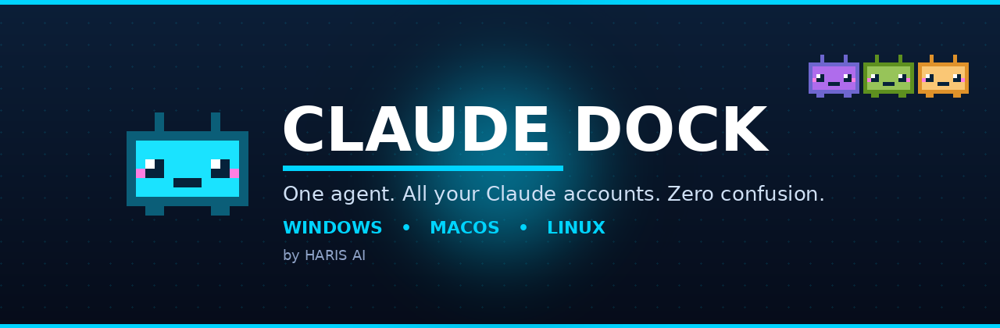

<!-- Replace Ai-Haris everywhere below with your GitHub username (Ctrl+H → Replace All) -->

<div align="center">



<br/><br/>

<h1>🤖 Claude Dock</h1>

<h3>One floating agent on your desktop. Hover it, and every Claude account appears.<br/>Click one to open its terminal. Double-click to open them all. <b>Zero confusion.</b></h3>

<br/>

<!-- ⬇️ DOWNLOAD BUTTONS (top, as requested) -->

<a href="https://github.com/Ai-Haris/claude-dock/releases/latest/download/Claude-Dock-Setup.exe"></a>
&nbsp;&nbsp;
<a href="https://github.com/Ai-Haris/claude-dock/releases/latest/download/Claude-Dock.dmg"></a>
&nbsp;&nbsp;
<a href="https://github.com/Ai-Haris/claude-dock/releases/latest/download/Claude-Dock.AppImage"></a>

<br/><br/>


<br/><br/>

<b>👉 Not sure which file?</b> Pick the one for your computer above. On a phone? Open this page on your PC.

</div>

---

## 💻 Prefer the terminal? One line.

If you have **Node.js** installed, skip the installer and run:

```bash
npx claude-dock
```

That's it — the agent launches. (First run downloads it once, then it's instant.)

> 🧩 Don't have Node.js? Grab it free from [nodejs.org](https://nodejs.org) — or just use the download buttons above.

---

## ✨ What it does

You're a freelancer or agency juggling **multiple Claude accounts** — one per client — on a single computer. Normally Claude Code remembers only one login at a time, so every switch means log out, log in, wait for a code, repeat. 😮‍💨

**Claude Dock fixes that.** A tiny neon agent floats on your desktop. Every client gets their own account, kept logged in **at the same time**. Hover the agent and they all fan out. One click opens that client's terminal — already in the right account, already in the right folder.

---

## 🚀 Features

| | |
|---|---|
| 🟢 **All accounts, always on** | Every client stays logged in together — no more logout/login churn |
| 🖱️ **Hover to reveal** | The agent sits quietly; hover and your accounts fan out in a neat ring |
| ⚡ **Open all at once** | Double‑click the agent → every client's terminal opens, stacked vertically |
| 🎯 **Smart positioning** | Drag the agent to any corner — the accounts fan into the open space automatically |
| 🤖 **Pixel‑robot avatars** | Each client gets a cute agent icon — or set your **own PNG** image per client |
| 🌈 **Neon‑breathing agent** | The master agent glows and breathes through neon colours |
| ➕ **Add clients in‑app** | One click creates a new client — folders and launcher build themselves |
| 🪟 **Windows · 🍎 macOS · 🐧 Linux** | Native terminals on all three |
| 🔒 **Nothing leaves your machine** | Logins and folders live locally; the app just opens terminals |

---

## 📦 Setup (60 seconds)

1. **Download** the file for your OS from the buttons at the top (or run `npx claude-dock`).
2. **Open it.** A glowing agent appears in the middle of your screen — drag it anywhere.
3. **Hover** the agent → your accounts fan out.
4. **First time per client:** click a client, log in with **that client's email** (they get a code, send it to you — one time only). After that, one click = straight in. ✅

> 💡 **Tip:** if your browser is already signed into a different Claude account, paste the login link into a **Private/Incognito** window so the right account connects.

---

## 🎬 Demo

<div align="center">

<!-- Add your reel / screen recording here as assets/demo.gif -->


*Hover → accounts appear · click → terminal · double‑click → all terminals*

</div>

---

## 🗺️ How it works

Claude Code keeps its login in one hidden folder. Claude Dock gives **each client their own folder** and simply launches Claude Code pointed at the right one. Different folder = different account = all logged in side by side. No magic, no risk — just clean separation. 🧠

```
~/Clients/<Name>/            → that client's project files
~/.claude-accounts/<Name>/   → that client's Claude login + history
~/.claude-dock/              → dock settings (names, images, position)
```

---

## 🛠️ Build it yourself

```bash
git clone https://github.com/Ai-Haris/claude-dock.git
cd claude-dock
npm install
npm start            # run in dev

npm run build:win    # → dist/Claude-Dock-Setup.exe   (run on Windows)
npm run build:mac    # → dist/Claude-Dock.dmg          (run on macOS)
npm run build:linux  # → dist/Claude-Dock.AppImage     (run on Linux)
```

> 🤖 **No Mac or Linux machine?** A free **GitHub Actions** workflow can build all three installers automatically on every release. (Ask Haris AI for the workflow file.)

---

## ⚠️ Responsible use

Use only accounts you're **authorized** to use — your own, a seat a client gave you on their Team plan, or a dedicated account a client created for the project. Personal Claude plans are meant for one person, so don't buy, sell, or casually share personal logins. For automations and bots, always use an **API key**, never a subscription login.

This is an independent tool by Haris AI and is **not affiliated with or endorsed by Anthropic**. Rules and products change — check Anthropic's latest terms before you share access.

---

## 💙 About Haris AI

**Haris AI** builds real AI systems for freelancers and businesses — n8n automations, Claude‑powered agents, voice AI, and full AI apps. Practical builds, no fluff.

<div align="center">

**Found this useful? ⭐ Star the repo and share it.**

<a href="https://www.instagram.com/theharis.ai/"></a>
&nbsp;&nbsp;
<a href="https://www.linkedin.com/in/ai-haris/"></a>
&nbsp;&nbsp;
<a href="https://www.youtube.com/@TheHarisHustle"></a>
&nbsp;&nbsp;
<a href="https://www.tiktok.com/@theharis.ai"></a>

<br/>

*Built with 💙 by Haris AI — One agent. Zero confusion.*

</div>
